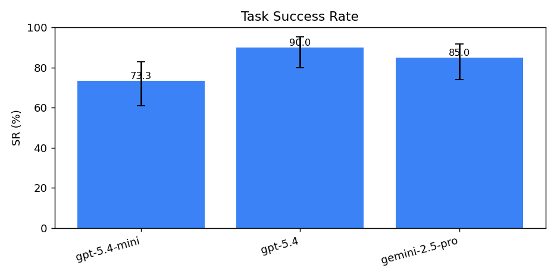
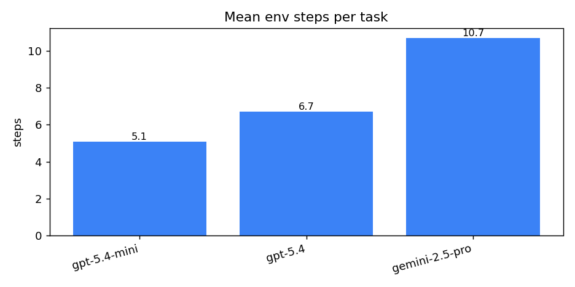
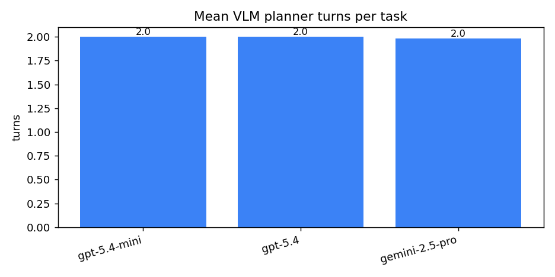
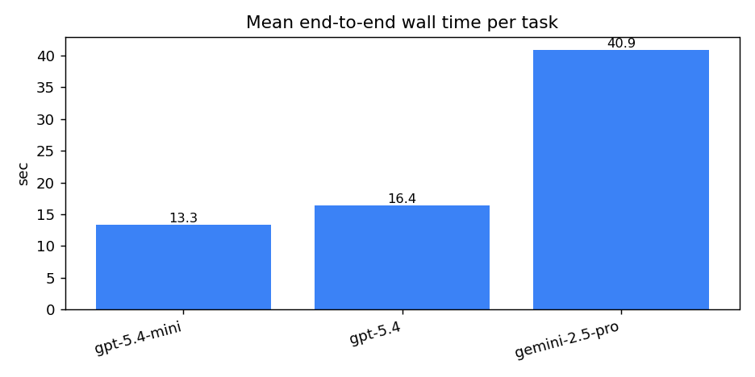

# Phase A cross-model aggregate

## Summary table
| Model | N | SR | 95% CI | mean steps | mean turns | mean wall s |
|---|---|---|---|---|---|---|
| gpt-5.4-mini | 60 | 73.3% | [61.0%, 82.9%] | 5.1 | 2.0 | 13.3 |
| gpt-5.4 | 60 | 90.0% | [79.9%, 95.3%] | 6.7 | 2.0 | 16.4 |
| gemini-2.5-pro | 60 | 85.0% | [73.9%, 91.9%] | 10.7 | 2.0 | 40.9 |

## Runs pooled per group
- **gpt-5.4-mini** (3 runs): phase_a_20260423_231222, phase_a_20260423_232032, phase_a_20260423_232532
- **gpt-5.4** (3 runs): phase_a_20260424_081146, phase_a_20260424_081801, phase_a_20260424_082424
- **gemini-2.5-pro** (3 runs): phase_a_20260424_083023, phase_a_20260424_084133, phase_a_20260424_085800
